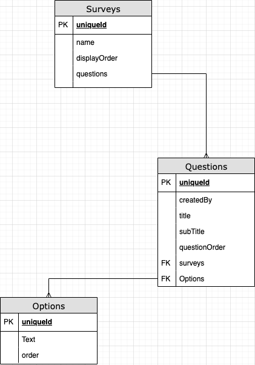

# API Design
### GET /surveys
- `router.get('/surveys', getAllSurveys);`

#### Returns 
- Success: 200
``` 
  allSurveys (sortBy: displayOrder_ASC){ 
        id
        name
        questions {
          title
          subTitle
          questionOrder
          options {
            text
            order
          }
        }
      }
    }
```

### GET /surveys/:id
- `router.get('/surveys/:id', getSurvey);`

#### Returns 
- Success: 200
``` 
{ 
  id
  name
  questions {
    title
    subTitle
    questionOrder
    options {
      text
      order
    }
  }
}
```
#### Errors:
- 500: Server error

# Directory structure
- assets
  - RelationshipDiagram.png
- controllers
  - GQL.js
  - surveyController.js
- dlist
- lists
  - OptionsSchema.js
  - QuestionsSchema.js
  - SurveySchema.js
- routes
  - surveyRoutes.js
- .env
- .node_modules
- .gitignore
- index.js
- initData.js
- package-lock.json
- package.json
- README.md

# Diagrams
